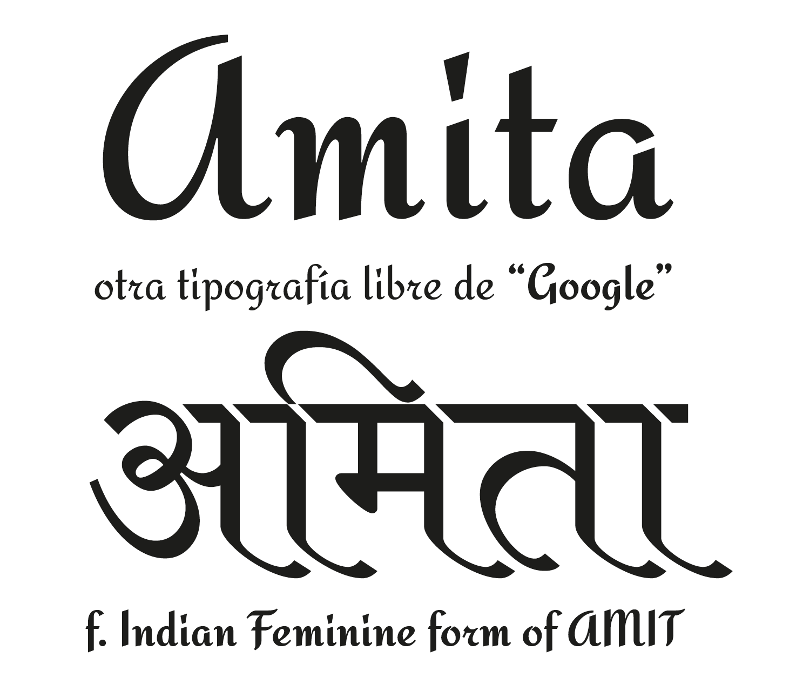

Amita is the Indian Feminine form of Amit. It is a Latin and Devanagari typeface derived from 
<a href="https://www.google.com/fonts/specimen/Redressed">Redressed</a> and Modular Infotech Devanagari 2310 and 1228.
The Latin is a script type designed by Brian Bonislawsky which blends script and italic letterforms together in an upright non-connecting style. 
Open spacing and stylish letterforms lend themselves to titling, but also to clean legibility at smaller sizes as body copy.
The Devanagari is a traditionally calligraphic style.
The combination was designed by Eduardo Tunni.

### Designer

* Eduardo Rodríguez Tunni

### License

Licensed under the [*SIL Open Font License, 1.1*](https://scripts.sil.org/OFL); you may not use this file except in compliance with the License.

To contribute to the project contact Eduardo Rodríguez Tunni > edu@tipo.net.ar
